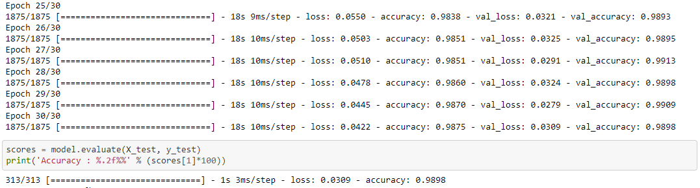
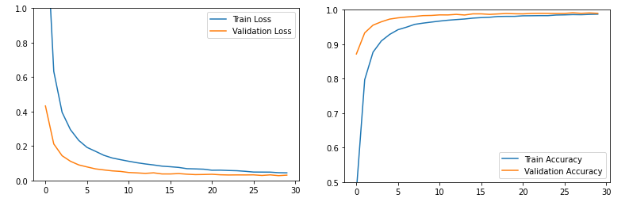
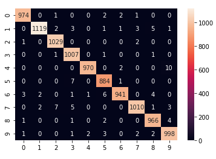
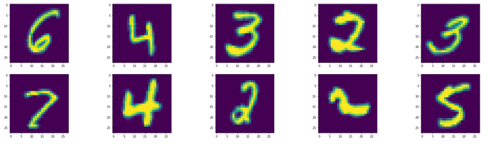

# Deep Detect Handwriting

Deep detect my handwriting is a app based on a CNN model, to recognize the digit that you draw on the canvas.  
You can check the model construction [here](https://github.com/leersmathieu/deep-detect-handwriting/blob/master/notebooks/CNN_Mnist.ipynb)

## Dataset :
i'm using Mnist dataset for this project.

```python
from tensorflow import keras
mnist = tf.keras.datasets.mnist
(X_train, y_train), (X_test, y_test) = mnist.load_data()
```

i'll make a little data augentation with keras 
```python
zoom_range=0.1
rotation_range=10
```


## Evaluation :




**Confusion matrix for each number :**  

  

Almost only good predictions on 10,000 tests.

## Try it yourself !

On **my serveur** http://deepwriting.tamikara.xyz/

OR

With **docker**


For try this app on your computer with docker, just enter this command in your terminal.   
It's magic.

```docker
docker run -p 8501:8501 leersma/deep-detect-handwriting:latest
```
just pay attention to the port used
If you run it on port 8501 as in the example, you can easily access it like this: http://localhost:8501/.

## Limitation :

As you can see, the model is very accurate. But in the reality of things he doesn't always recognize the numbers I enter. The problem for me is that the data on which the model is trained is not necessarily relevant to recognize numbers written "European style" and even less with a computer mouse.



